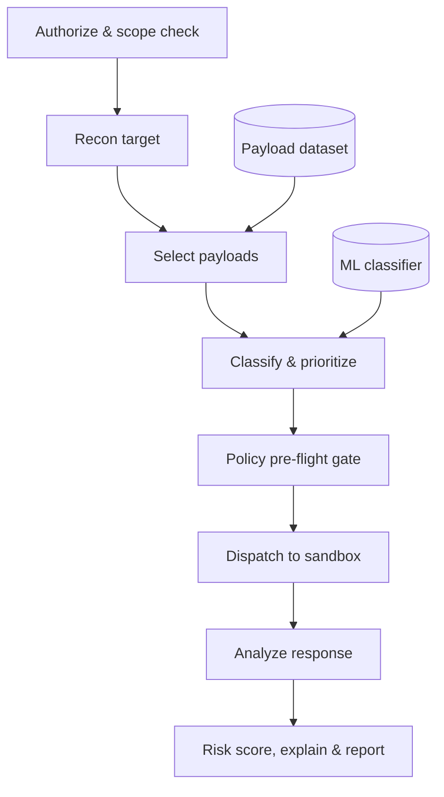

# Offensive IT-Tester

An AI-powered web-application vulnerability tester built for the **Responsible AI & Data Ethics** course. The system trains a classifier on a payload dataset and drives an LLM agent that tests a **sandboxed** target, with every action passing through a governance layer.

The grading emphasis is **responsibility, ethics, and safety** — not offensive capability. The architecture reflects that: the interesting engineering is the governance middleware and the scope-locking, not the attacks themselves.

---

## Project status

| Stage | Deliverable | State |
|-------|-------------|-------|
| Data | Raw-repair + pandas cleaning pipeline (`preprocess.py`) | Done |
| Data | Cleaned dataset (`payloads_clean.csv` / `.jsonl`, 455 rows) | Done |
| Analysis | Exploratory data analysis (`01_eda.ipynb`) | Done |
| Model | Feature engineering + classifier (`02_model_dev.ipynb`) | Next |
| Agent | Orchestrator, tools, governance middleware | Planned |
| Governance | Model card, risk assessment, datasheet, DPIA | Planned |

---

## Folder architecture

```
offensive-it-tester/            (project root: RADE)
├── data/
│   ├── raw/                     # original payload file (read-only input)
│   ├── processed/               # payloads_clean.csv / .jsonl (pipeline output)
│   └── schema.md                # field + class documentation
├── notebooks/
│   ├── 01_eda.ipynb             # exploratory data analysis        [done]
│   ├── 02_model_dev.ipynb       # classifier training              [next]
│   └── 03_fairness_eval.ipynb   # class balance / fairness
├── preprocess/
│   └── preprocess.py            # two-stage cleaning pipeline       [done]
├── src/
│   ├── model/
│   │   ├── train.py
│   │   ├── classifier.py        # exposed via the `classify` tool
│   │   ├── evaluate.py
│   │   └── explain.py           # feature attribution / SHAP
│   ├── agent/
│   │   ├── orchestrator.py      # reason -> act -> observe loop
│   │   ├── registry.py          # tool schemas + registration
│   │   ├── state.py             # per-run context / memory
│   │   └── tools/               # one module per tool (see registry below)
│   ├── governance/
│   │   ├── middleware.py        # wraps every tool call
│   │   ├── guardrails.py        # allowlist, rate limit, kill-switch
│   │   ├── policy.py            # check_policy logic
│   │   ├── consent.py           # authorization-token check
│   │   └── audit.py             # log_event, immutable log
│   ├── sandbox/
│   │   ├── docker-compose.yml   # vulnerable target(s)
│   │   └── targets.md           # allowlist definition
│   └── reporting/
│       ├── report_builder.py
│       └── templates/
├── config/
│   ├── policy.yaml              # scope, allowlist, rate limits
│   ├── model_config.yaml
│   └── logging.yaml
├── governance/                  # graded documentation artifacts
│   ├── model_card.md
│   ├── risk_assessment.md
│   ├── datasheet.md
│   └── dpia.md                  # data protection impact (GDPR)
├── reports/                     # generated run outputs
├── tests/
│   ├── test_data.py
│   ├── test_model.py
│   ├── test_tools.py
│   └── test_guardrails.py       # proves the kill-switch actually blocks
├── requirements.txt
├── .env.example
└── README.md
```

The split between `src/governance/` (enforcement code) and top-level `governance/` (documentation) is deliberate: one is the mechanism, the other is the evidence. Both are graded.

---

## System architecture

The agent is **LLM-orchestrated** with a ReAct-style loop (reason -> pick a tool -> act -> observe). The classifier is one tool among several, not the controller. The core safety property is that **every state-changing tool call is wrapped by a governance middleware**: a policy pre-flight before the call and an immutable audit record after it.

```
              Agent orchestrator  (reason -> act -> observe)
                        |
                        v
              Governance middleware   check_policy (pre-flight) + log_event (audit)
                        |
                        v
                  Tool registry  ->  Payload dataset | ML classifier | Sandbox target
```

The single most important design choice: the only tool that touches the live target is `dispatch_payload`. All risk funnels through one guarded path, so the safety of the whole system reduces to one testable question — *can an out-of-scope or unauthorized `dispatch_payload` ever execute?* — which `tests/test_guardrails.py` answers.

### Runtime data flow



`log_event` fires at every step, not just the governance gates — it is the audit trail that makes a run reproducible and accountable.

---

## Tool registry

Ten tools. Eight are worker tools the orchestrator chooses; two are governance tools the middleware invokes automatically around every call.

| Tool | Purpose | Governance gate |
|------|---------|-----------------|
| `profile_target` | Recon the sandbox, enumerate input surfaces & context | Target must be in allowlist |
| `select_payloads` | Retrieve dataset payloads by class + context | Read-only |
| `classify` | Predict class + severity (the trained model) | Read-only |
| `dispatch_payload` | Send one payload to the target, capture response | **Allowlist + rate limit + cap + kill-switch** |
| `analyze_response` | Decide success, extract evidence | Logged |
| `score_risk` | Combine severity + evidence into a CVSS-style rating | Logged |
| `explain` | Feature attribution / rationale for a decision | Logged |
| `build_report` | Assemble validated findings into a report | Logged |
| `check_policy` | Pre-flight: scope, authz, consent, rate limits | *(middleware)* |
| `log_event` | Append immutable audit record of every call | *(middleware)* |

---

## Dataset & data analysis findings

**Source:** web-application payloads, provided as a file named `.jsonl` that is actually a pretty-printed JSON array.

**Cleaning was two-stage** because the raw file would not parse at all:

1. *Raw-text repair* (before pandas): removed 45 non-breaking spaces (U+00A0) from a copy-paste, fixed 1 missing comma between records, and escaped 1 invalid `\x` backslash sequence. CRLF endings left as-is.
2. *Pandas cleaning*: derived `attack_class` from the `id` prefix, unified the inconsistent `example_query` / `example_usage` fields into one `example` column, stripped whitespace, dropped 1 empty payload, and removed 44 duplicate payloads (with **zero label conflicts**, so deduplication was safe).

**Result: 500 raw records -> 455 clean records.**

### Key findings

- **Five balanced classes**, not the four originally assumed: `xss` (100), `csrf` (95), `cmdi` (88), `sqli` (87), `ssrf` (85). The `csrf` class was not in the original brief — **confirm scope with the professor**.
- **No benign class.** The dataset is entirely attack payloads, so a classifier trained on it alone cannot label traffic as *safe*. This is the central scope gap and must be documented in the model card and risk assessment.
- **Severity is imbalanced** (skewed toward high/medium; critical and low are minorities). Relevant to risk scoring and the fairness evaluation — exact per-class figures are in `01_eda.ipynb` step 3.
- **Rich metadata** (`type`, `context`, `severity`) supports agent selectivity: `select_payloads` filters on `context`, and `type` gives sub-type granularity within each class.
- **Label-leakage risk is real.** The label is derived from `id`, and `description` / `example` frequently name the attack outright. Only `payload` (and features engineered from it) is a safe model input. See `01_eda.ipynb` step 8.

### Cleaned schema

| Column | Notes |
|--------|-------|
| `id` | e.g. `sqli-001`. **Do not use as a feature** (encodes the label). |
| `attack_class` | Target label, derived from `id`. |
| `payload` | The attack string. **Primary feature source.** |
| `type` | Sub-type within a class (e.g. `tautology`, `blind-time`). |
| `severity` | Ordered: low < medium < high < critical. |
| `context` | Where the payload applies (e.g. `Login form`). |
| `description` | Human documentation. Leaks the label — not a feature. |
| `example` | Merged example query/usage; null for many rows. |

---

## How to run

```bash
# 1. setup
python -m venv .venv
.venv\Scripts\activate            # Windows;  source .venv/bin/activate on macOS/Linux
pip install -r requirements.txt

# 2. put the raw file at data/raw/, then clean it
python -m preprocess.preprocess    # writes data/processed/payloads_clean.{csv,jsonl}

# 3. run the exploratory analysis
jupyter lab notebooks/01_eda.ipynb
```

---

## Responsible-AI framing

The project is assessed against the EU AI Act, GDPR (data minimisation), German computer-crime law, OWASP, ISO/IEC 42001, the NIST AI RMF, and the course's Value-Based Engineering and IBM five-pillars frameworks. The design decisions above map to those directly: scope-locking and the kill-switch address legality and safety; the audit log addresses accountability and traceability; the leakage audit and fairness evaluation address the data-ethics dimension; and the model card documents intended use and known limitations (above all, the missing benign class).