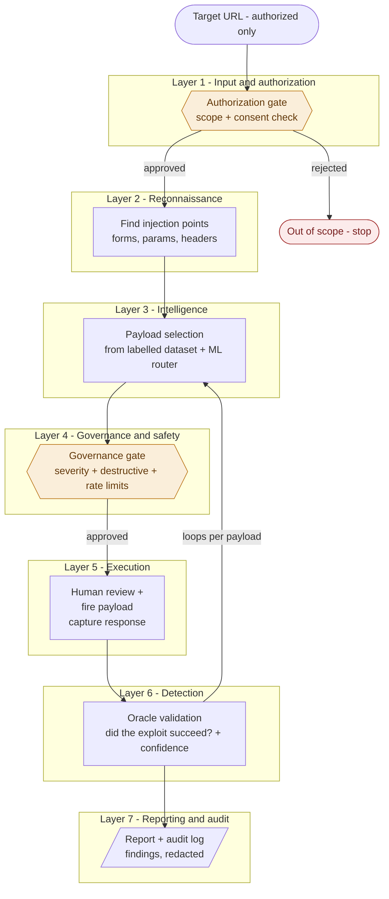

# Offensive IT-Tester

An AI-assisted, **autonomous-but-bounded web-application vulnerability scanner** built for
the *Responsible AI & Data Ethics* course. It takes an **authorized target URL**, uses a
labelled payload arsenal to attack known injection points (SQLi, XSS, CMDi, SSRF, CSRF),
**verifies which vulnerabilities are real**, and produces a redacted, fully audited report.

The offensive capability is the smaller part — the graded emphasis is on making it
**responsible**: authorization at the front, safety limits during, transparency throughout,
and accountability around the whole thing.

> **Scope & safety.** The scanner only runs against targets on an explicit allowlist — in
> practice a deliberately vulnerable app we host ourselves (OWASP Juice Shop / DVWA) in an
> isolated environment. It *cannot* be pointed at an arbitrary third-party site. This keeps
> the project within German law (§202a/b/c StGB), GDPR, and the EU AI Act.

---

## Project status

| Stage | State |
|---|---|
| Data engineering (repair → clean → benign corpus → final dataset) | ✅ **done** |
| Exploratory analysis (`preprocess/analysis.ipynb`) | ✅ **done** |
| Baseline model + fairness + risk (`models/baseline.ipynb`) | ✅ **done** |
| **Layers 1–3: authorization → recon → payload selection** (`main.py`) | ✅ **done** |
| Layer 4–7: governance gate, execution, detection oracles, reporting | ◻ **planned** (design below) |

This README documents both what exists today and the target design it plugs into.

---

## 1. Conceptual architecture (seven layers)

Data flows down; results come back up. The two **safety gates** (authorization and
governance) are the responsible-AI control points.



**In plain language.** You hand the tool an authorized URL. The **authorization gate** asks
"am I allowed to touch this?" — if not, everything stops. **Reconnaissance** finds the doors
(input fields, parameters). The **intelligence layer** picks known payloads for each door
from the dataset (it never invents payloads). Before firing, the **governance gate** asks
"is it safe to send *this* one now?" — destructive payloads are held/escalated and the rate
is throttled. Approved payloads are **fired**, the response is read, and the **detection
layer** decides whether a real vulnerability triggered. That select → gate → fire → verify
cycle **loops** across every injection point. Finally the **report** stage collects confirmed
findings, strips real personal data, and writes a report plus a tamper-evident audit log.

---

## 2. How exploitation is verified (the detection oracles)

The dataset is only an *arsenal*; it contains no target responses, so **success cannot be
read from it** — it must be observed on the target. Every fired payload is validated against
a **benign baseline** by one of six **oracle** strategies, keyed on the payload's `type`.
Where possible we **plant a signal we control** (a nonce, a delay, an out-of-band token) so
detection is uniform and near-deterministic.

| Oracle | Proves success by | Used for |
|---|---|---|
| `timing` | response time ≫ baseline (planted delay) | blind-time, stacked-queries SQLi |
| `error_signature` | DB error the baseline didn't show | error-based SQLi |
| `marker_reflection` | a planted nonce is returned by the backend | union SQLi, CMDi echo |
| `differential` | true-vs-false condition responses diverge | tautology, boolean-blind SQLi |
| `browser_execution` | injected JS actually *runs* (headless browser) | reflected/stored XSS |
| `out_of_band` | your collaborator server receives a callback | SSRF, blind CMDi |
| `state_change`\* | forged cross-origin request changes state w/o token | CSRF (semi-manual) |

Each payload already carries its `oracle` label in the dataset. Findings are reported with a
**confidence tier** (high = planted signal returned; medium = timing/differential, confirmed
by repetition; low = unconfirmed → flagged for manual review, never auto-claimed).

---

## 3. Project architecture (folders & files)

```
RADE/
├── README.md                      # this file
├── requirements.txt
├── LICENSE
│
├── main.py                        # ✅ pipeline driver: runs Layers 1-3, prints selected payloads
│
├── config/                        # ✅ paths + safety rules as DATA
│   ├── paths.py                   #    canonical project paths (ROOT/DATA/RAW_DIR/CLEAN/PROCESSED)
│   ├── target_allowlist.yaml      #    the scope firewall — which hosts may be scanned (sandbox only)
│   └── targets/dvwa.yaml          #    DVWA sandbox injection-point profile (recon input)
│
├── data/
│   ├── raw/                       # ✅ untouched sources
│   │   ├── WEB_APPLICATION_PAYLOADS.jsonl   # Kaggle attack payloads (needs repair)
│   │   └── csic_2010_benign.csv             # benign extract from HTTP DATASET CSIC 2010 (GPL-3.0)
│   ├── cleaned/                   # ✅ cleaned + execution-ready outputs
│   │   ├── payloads_clean.jsonl / .csv      # 455 repaired, deduped attack payloads
│   │   └── dataset_final.jsonl / .csv       # 2,455-row attack+benign dataset (the deliverable)
│   └── processed/                 # ✅ analysis artifacts
│       ├── payloads_bucketed.jsonl          # attack payloads + context_bucket (from analysis.ipynb)
│       ├── dataset_final.jsonl / .csv       # mirror of the final dataset
│       └── DATA_CARD.md                     # provenance, schema, severity policy, limitations
│
├── preprocess/                    # ✅ the data pipeline
│   ├── preprocess.py              #    STAGE 1-2: raw-text repair + pandas cleaning
│   ├── benign_corpus.py           #    loads/maps/samples benign inputs from CSIC 2010
│   ├── build_dataset.py           #    MASTER: repair → clean → bucket → severity → oracle → merge
│   └── analysis.ipynb             #    EDA: class/severity/context, bucketing, destructive scan
│
├── models/                        # ✅ baseline model
│   ├── baseline.ipynb             #    trains + evaluates + saves; ends with fairness & risk
│   ├── clf_binary.pkl             #    attack-vs-benign detector
│   └── clf_attack_class.pkl       #    5-way attack_class router
│
└── src/                           # the scanner (maps onto layers 1-7)
    ├── authorization/authorize.py # ✅ L1 — allowlist / scope firewall
    ├── recon/recon.py             # ✅ L2 — injection-point discovery (profile-based)
    ├── intelligence/select.py     # ✅ L3 — payload selection from the arsenal
    ├── governance/                # ◻ L4 — severity / destructive holds, rate limits
    ├── execution/                 # ◻ L5 — fire payloads, capture responses
    ├── detection/                 # ◻ L6 — the six confirm() oracles
    └── reporting/  audit/         # ◻ L7 — report + tamper-evident log
```

**Two deliberate choices carried from the design:** `config/` will hold safety rules as
readable *data* (allowlist, thresholds) so an examiner can see the scope firewall at a glance;
and `audit/` will be separate from `reporting/` because reports are for the user while audit
logs are the tamper-evident record of what the agent actually did.

---

## 4. The dataset

`data/cleaned/dataset_final.jsonl` — **2,455 rows**, one input string per row.

| Half | Rows | Source |
|---|---|---|
| attack | 455 | Kaggle `WEB_APPLICATION_PAYLOADS` (repaired, deduped from 500) |
| benign | 2,000 | **HTTP DATASET CSIC 2010** normal traffic (sampled, seed 42) |

**15-field schema:**

| field | meaning |
|---|---|
| `id` · `label` · `attack_class` · `type` | identity + the two model targets (attack/benign, 5-way) |
| `payload` | the raw string to send (the **only** model feature) |
| `context` · `context_bucket` | injection point (free-text + normalised to 14 buckets) |
| `severity` · `severity_original` · `severity_reason` | **recomputed** severity + audit trail |
| `is_destructive` · `destructive_flags` | governance-gate hold signals |
| `oracle` | which detection oracle validates this payload |
| `description` · `example` | human context |

### Data quality work (why the pipeline exists)
The raw Kaggle file was **not valid JSON**: 45 non-breaking spaces (some breaking parsing),
a missing comma, a bad escape, 1 empty payload, and 44 duplicate payloads. `preprocess.py`
repairs and de-dupes it. Severity labels were **internally inconsistent** (reflected == stored
XSS, all blind SQLi == medium, CMDi split across three levels), so `build_dataset.py`
**recomputes severity** from a documented `(class, technique)` policy plus payload-content
overrides — **283 / 455 labels changed**, with `severity_original` + `severity_reason` kept
for auditability. Full details in [`data/processed/DATA_CARD.md`](data/processed/DATA_CARD.md).

---

## 5. Baseline model

`models/baseline.ipynb` — **char n-gram TF-IDF + Logistic Regression**, two tasks, with
leakage guards (payload-text-only features, exact-duplicate removal, stratified hold-out,
`class_weight="balanced"`, `DummyClassifier` reference).

| Task | What it does | Macro-F1 | Dummy ref |
|---|---|---|---|
| A — attack vs benign | input-side "is this an attack?" detector | **0.986** | 0.449 |
| B — attack_class (5-way) | router → picks the detection oracle | **0.991** | 0.072 |

**Honest read:** scores are high because the data is easy (clean benign vs syntactically loud
payloads) — treat them as an upper bound. The value is in the **5 false negatives** (SSRF/CMDi
with exotic schemes like `tel:`/`magnet:`, short Windows commands, and encoded payloads) — the
model breaks exactly where an attacker would push. It is kept **advisory, not authoritative**:
the live loop routes by the dataset `type`, so a model error can never silently drop a real
payload. The notebook ends with the model's own **fairness evaluation** and **risk
assessment** (NIST Map → Measure → Manage).

---

## 6. The scanner pipeline (Layers 1–3)

`main.py` runs the first three layers and **stops before firing** — it prints the payloads
the agent *would* send at each injection point. No request is made; it is safe to run.

```bash
python main.py                    # default sandbox target (127.0.0.1:8080)
python main.py http://example.com # authorization gate REJECTS (out of scope)
```

**What each layer does**
1. **Authorization** — approves the URL only if it's an allowlisted **loopback** sandbox
   host; `example.com` and wrong ports are rejected with a reason (the scope firewall).
2. **Recon** — reads the DVWA sandbox profile (`config/targets/dvwa.yaml`) and returns the
   injection points (live crawling is a later add-on).
3. **Selection** — picks payloads from `dataset_final` per injection point (by attack class
   + context bucket), **stratified by technique**: it groups candidates by `type` and takes
   the best `k_per_type` (=2) of *every* technique, so no technique is skipped. Each is tagged
   with the `oracle` that will verify it.

**Sample output** (trimmed):
```
[LAYER 3] PAYLOAD SELECTION
  ▶ sqli_id  (GET id, bucket=url_param)  → 3 payloads
      [sqli-016 ] sqli/blind-time    high  oracle=timing          "' OR SLEEP(5)--"
      [sqli-004 ] sqli/error-based   high  oracle=error_signature "' AND 1=CONVERT(int,@@version)--"
SELECTED 25 payloads across 6 injection points  by class {sqli:11, xss:6, csrf:4, cmdi:2, ssrf:2}
  technique coverage (stratified by type):
      sqli  → blind-time, boolean-blind, error-based, tautology, union
```

**Responsibility analysis of this pipeline** — selection now **stratifies by technique**, so
SQLi technique coverage rose **3/6 → 5/6** (`union` & `error-based` are now fired). The one
remaining gap, `stacked-queries`, is **unreachable from the current injection points** — a
*recon* blind spot, not a selection bias. Documented with before/after numbers in
[`docs/fairness_evaluation.md`](docs/fairness_evaluation.md) and
[`docs/risk_assessment.md`](docs/risk_assessment.md). (The baseline *model's* fairness/risk
is separate, inside `models/baseline.ipynb`.)

---

## 7. Reproduce

```bash
# 1. rebuild the final dataset (writes to data/cleaned and data/processed)
python -m preprocess.build_dataset

# 2. train + evaluate + save the baseline models, then read fairness & risk
#    open models/baseline.ipynb and run all cells (use the .venv kernel)

# 3. run the scanner pipeline (Layers 1-3) — prints the payloads it would fire
python main.py                         # default sandbox target (127.0.0.1:8080)
python main.py http://example.com      # shows the authorization gate rejecting
```

The notebook adds the project root to `sys.path` automatically, so it runs whether the kernel
starts in `models/` or the repo root.

**Core dependencies:** `pandas`, `scikit-learn`, `matplotlib`, `joblib`, `jupyter`
(+ `requests`/`httpx`, `beautifulsoup4`, `PyYAML`, `Jinja2` for the planned scanner). See
`requirements.txt`.

---

## 8. Regulatory & ethics frameworks

| Framework | Relevance |
|---|---|
| **EU AI Act** (Reg. 2024/1689) | Not a prohibited practice (Art. 5) and not high-risk (Art. 6/Annex III) — a sandboxed academic scanner matches no Annex III category. One live duty: Art. 50 transparency (label AI-generated output). |
| **GDPR** (Reg. 2016/679) | Art. 5(1)(c) data minimisation — training data is payload strings + benign inputs only; **CSIC 2010 is auto-generated, so no real PII**. Purpose (Art. 5(1)(b)) and storage limitation (Art. 5(1)(e)) documented. |
| **StGB** §202a/b/c, §303a/b | Data espionage / interception / hacking-tools / data alteration / sabotage — all neutralised by the **self-owned sandbox + enforced target-scoping + non-destructive default mode + documented authorization** (the central lawfulness argument). |
| **OWASP Top 10** (A03 Injection) + **LLM Top 10** (LLM01/LLM08) | Grounds *what* is tested (injection classes) and the agent-safety concerns (prompt injection, excessive agency → bounded agency, validated inputs). |
| **ISO/IEC 42001** · **NIST AI RMF** | Borrowed structure for the governance layer, risk log, and model card (Govern / Map / Measure / Manage). |

---

## 9. Roadmap
1. **Fairer selection** — ✅ **done**: selection stratifies by `type` (`k_per_type=2`) so
   `union` / `error-based` SQLi are no longer skipped (3/6 → 5/6 techniques). Remaining:
   expose a `form_field` SQLi injection point in recon so `stacked-queries` becomes reachable.
2. **Governance gate (Layer 4)** — hold `is_destructive`/critical payloads for review and
   throttle rate, as YAML rules; **required before execution is enabled**.
3. **Live recon** — wire the requests + BeautifulSoup crawler as primary, profile as fallback.
4. **Execution + detection (Layers 5–6)** — fire payloads at DVWA and implement the six
   `confirm()` oracles; add an adversarial eval set to measure evasion.
5. **Reporting + audit (Layer 7)** — findings report + tamper-evident log.
