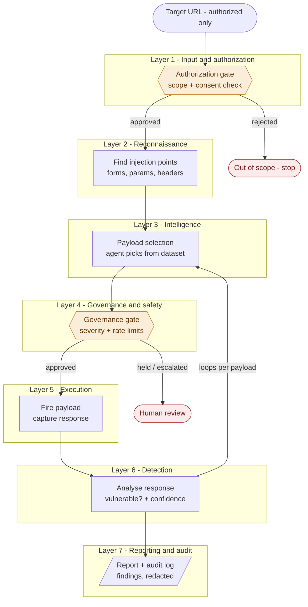

# Offensive IT-Tester

An AI-powered, **autonomous web-application vulnerability scanner** built for the
*Responsible AI & Data Ethics* course. It takes an **authorized target URL**, uses
an agent to select attack payloads from a fixed, labelled dataset, fires them at the
target through two safety gates, confirms which vulnerabilities are real, and produces
a redacted, fully audited report.

The system is deliberately **autonomous but bounded**: authorization at the front,
safety limits during, transparency throughout, and accountability around the whole
thing. The offensive capability is the smaller part of the project — the graded
emphasis is on making that capability **responsible**.

> **Scope & safety note.** The scanner only runs against targets on an explicit
> allowlist, which in practice means a deliberately vulnerable app we host ourselves
> (e.g. OWASP Juice Shop / DVWA) in an isolated environment. It is designed so it
> *cannot* be pointed at an arbitrary third-party site. This keeps the project within
> German law (§202a/b/c StGB), GDPR, and the EU AI Act.

---

## 1. Project architecture
 
The system is seven layers. Data passes down through them and results come back up.
The two **safety gates** (authorization and governance) are the responsible-AI control
points, shaded below.
 

 
**How to read it.** The two hexagonal nodes are the safety gates — every scan passes
through both, and the governance gate fires *repeatedly* because selection → gate →
execute → detect **loops** for every payload. The two red nodes are the exits that
protect against harm: an out-of-scope target is rejected outright, and dangerous
payloads are escalated to a human rather than fired automatically.
 
**Where the ML model lives.** Because payloads arrive pre-labelled, the model does
**not** classify payloads. Its job is response analysis in layer 6 — deciding whether
a target's response indicates a real vulnerability. (An optional secondary use is
context-matching in layer 3.) This decision is recorded in the model card.
 
---

## 2. Runtime data flow

One journey, from URL to report:

```
        Target URL (authorized only)
                  │
                  ▼
        ┌───────────────────────┐
        │  AUTHORIZATION GATE    │  ◄── scope + consent check; rejects out-of-scope
        └───────────────────────┘
                  │
                  ▼
        ┌───────────────────────┐
        │   Reconnaissance       │  ── find injection points
        └───────────────────────┘
                  │
                  ▼
        ┌───────────────────────┐  ◄─────────────┐
        │   Payload selection    │  ── agent picks from dataset
        └───────────────────────┘                │
                  │                               │
                  ▼                               │  loops
        ┌───────────────────────┐                │  per
        │   GOVERNANCE GATE      │  ── severity + │  payload
        │                        │     rate limits│
        └───────────────────────┘                │
                  │                               │
                  ▼                               │
        ┌───────────────────────┐                │
        │   Execute & detect     │  ── fire, read, confirm
        └───────────────────────┘  ───────────────┘
                  │
                  ▼
        ┌───────────────────────┐
        │   Report               │  ── findings, redacted + logged
        └───────────────────────┘
```

**In plain language.** You hand the tool an authorized URL. The **authorization gate**
asks "am I allowed to touch this?" — if not, everything stops. If approved,
**reconnaissance** finds the doors (input fields, parameters). The **agent** then picks
suitable known payloads for each door from the dataset — it never invents new ones. Before
any payload is fired, the **governance gate** asks "is it safe to send *this* one right
now?" — destructive payloads are held or escalated, and the request rate is throttled.
Approved payloads are **fired**, the response is read, and **detection** decides whether a
real vulnerability triggered. That select → gate → fire → check cycle **loops** across every
injection point and payload until the target is fully tested. Finally, the **report** stage
collects confirmed findings, strips out any real personal data, and writes both a
human-readable report and a tamper-evident audit log.

The safety gate can fail in **two directions**, and the risk assessment names both:
*too permissive* (lets through a destructive payload, DoSes the target, wanders out of
scope, or leaks personal data into logs) or *too restrictive* (blocks so much that a
"no vulnerabilities found" result is really a broken gate, not a secure target). Every
gate block is logged **with a reason** so a genuine clean result can always be told apart
from a gate that stopped everything.

---

## 3. Folder architecture (with tools)

Folders map one-to-one onto the seven layers. `docs/` maps onto the graded deliverables.

```
offensive-it-tester/
├── README.md
├── requirements.txt
├── main.py                      # entry point: takes a URL, runs the pipeline
│
├── config/                      # safety rules stored as DATA, not buried in code
│   ├── config.yaml              # rate limits, thresholds, timeouts
│   ├── target_allowlist.yaml    # authorized targets — the scope firewall
│   └── severity_policy.yaml     # which severities / patterns need holding or escalation
│                                #   tools: PyYAML
│
├── data/
│   ├── raw/                     # original Kaggle dataset, untouched
│   ├── cleaned/                 # cleaned payloads (payloads_clean.jsonl, 455 rows)
│   └── processed/               # bucketed context + trimmed duplicates (post-analysis)
│
├── notebooks/
│   └── analysis.ipynb           # exploratory data analysis (7 steps)
│                                #   tools: pandas, re, difflib
│
├── src/
│   ├── authorization/           # layer 1 — scope + consent checks
│   │                            #   tools: PyYAML, urllib/tldextract (domain parsing)
│   ├── recon/                   # layer 2 — injection-point discovery
│   │                            #   tools: requests / httpx, BeautifulSoup (bs4)
│   ├── intelligence/            # layer 3 — agent + payload selection + ML
│   │                            #   tools: pandas, scikit-learn
│   ├── governance/              # layer 4 — safety gates, severity, rate limiting
│   │                            #   tools: PyYAML, re, custom rule engine
│   ├── execution/               # layer 5 — fire payloads, capture responses
│   │                            #   tools: requests / httpx
│   ├── detection/               # layer 6 — response analysis, confirm vulns
│   │                            #   tools: scikit-learn, re
│   ├── reporting/               # layer 7 — report generation + redaction
│   │                            #   tools: Jinja2 (templates), re (PII redaction)
│   └── audit/                   # cross-cutting — immutable run logs
│                                #   tools: Python logging / structured JSON logs
│
├── models/
│   ├── classifier.pkl           # trained response-analysis model
│   └── model_card.md            # what it does, limitations, the benign-class gap
│
├── docs/                        # graded deliverables
│   ├── risk_assessment.md       # threat → likelihood → impact → mitigation
│   ├── fairness_evaluation.md   # detection coverage across classes
│   ├── explainability.md        # why each payload was fired / flagged
│   └── regulatory_mapping.md    # EU AI Act, GDPR, StGB, OWASP, ISO 42001, NIST AI RMF
│
├── reports/                     # generated scan outputs (gitignored)
│
└── tests/                       # pytest — one test module per src/ layer
                                 #   tools: pytest
```

Two deliberate choices: `config/` holds the safety rules as readable data so an examiner
can open `target_allowlist.yaml` and see the scope firewall at a glance; and `audit/` is
separate from `reporting/` because reports are for the user while audit logs are the
tamper-evident record of what the agent actually did.

**Core dependencies:** `pandas`, `scikit-learn`, `requests`/`httpx`, `beautifulsoup4`,
`PyYAML`, `Jinja2`, `pytest`.

---

## 4. Data analysis findings

Dataset: `payloads_clean.jsonl`, **455 rows**. Fields: `id`, `attack_class`, `payload`,
`type`, `severity`, `context`, `description`, `example`.

### Correction applied
The class distribution was initially run on the `type` column, which mixes whole classes
(`CSRF`, `Command Injection`, `SSRF`) with sub-techniques of SQLi and XSS (`tautology`,
`union`, `reflected`, `stored`, …). The correct label is **`attack_class`**. Grouped
properly, the arsenal is well balanced:

| Attack class | Count | Share |
|---|---|---|
| XSS (reflected + stored) | 100 | 22.0% |
| CSRF | 95 | 20.9% |
| Command Injection | 88 | 19.3% |
| SQLi (6 sub-types) | 87 | 19.1% |
| SSRF | 85 | 18.7% |

The `type` column is kept only as a *within-SQLi / within-XSS* sub-analysis (e.g. SQLi
leans heavily on blind/time-based; only 4 `error-based` and 9 `union` payloads).

### Findings by analysis

1. **Class distribution.** Balanced across the five real classes (~19–22% each). The
   original "under-armed classes" warning was an artifact of the wrong column. **Scope
   note:** the dataset has **five** classes, not the four in the brief — **CSRF is present**
   and was not planned for; decide whether it is in scope.

2. **Severity distribution.** high 53.2%, medium 30.3%, critical 13.8%, low 2.6%.
   **67% (305 payloads) are high-or-critical**, so the governance gate fires on most
   payloads, not occasionally. Critical payloads cluster in **SSRF (21), Command Injection
   (19), CSRF (12), stacked-query SQLi (11)**. Blind SQLi sub-types are all labelled
   `medium`, arguably too low for attacks that can hang a server.

3. **Context analysis.** The weak spot. **230 distinct free-text context values**, 221 of
   them with fewer than 5 payloads, with heavy overlap in meaning ("User input field",
   "User input", "Search input", "Search field" are the same door). **Context cannot drive
   selection until it is normalised into a small set of injection-point buckets.** This is
   the highest-priority data-prep task.

4. **Coverage matrix.** Blocked on (3). Because context has 230 values, the class × context
   matrix is huge and mostly empty, making the "blind spot" count meaningless. Rebuild it
   *after* bucketing context; it then becomes the honest coverage map for performance and
   responsibility.

5. **Destructive-payload detection.** **64 destructive payloads found; 30 of them are NOT
   labelled high/critical** (e.g. `ftp://127.0.0.1/`, `smtp://127.0.0.1:25` sitting at
   `medium`). Key responsibility finding: **the gate cannot rely on severity labels alone
   and must also pattern-scan the payload text.** Caveat: the `ssrf_metadata` pattern
   currently flags ordinary `127.0.0.1`/`localhost` SSRF probes as destructive — split
   "reaches internal host" from "destroys data" so the gate isn't over-broad.

6. **Duplicate detection.** Only **1 exact duplicate** (a casing difference), but **155
   near-duplicate pairs** — many XSS payloads differing only by a counter, and near-identical
   CSRF forms. The *effective* arsenal is smaller than 455; trimming saves request budget
   and reduces DoS risk.

7. **Data quality.** Clean where it matters: **zero missing `context` or `severity`**, zero
   unusable rows. Only `example` is sparse (248 missing), and it drives no logic.
   **Known limitation:** the dataset is **attack-only, with no benign class**, so the
   detection layer has no "normal response" baseline to calibrate against — documented in
   the model card and risk assessment.

### Immediate next steps (in order)
1. Redo the distribution on `attack_class` (quick fix).
2. **Normalise the 230 `context` strings into a handful of injection-point buckets** — this
   single fix unblocks payload selection *and* the coverage matrix.
3. Turn the 64 destructive payloads (minus the over-broad localhost flags) into
   `severity_policy.yaml` gate rules, since 30 of them prove labels can't be trusted.
4. Decide CSRF scope and record the benign-class gap in the model card.

---

## 5. Regulatory & ethics frameworks

The project is mapped against: **EU AI Act** (including the May 2026 Digital Omnibus
changes), **GDPR** (data minimisation, PII redaction), **German criminal law**
(§202a/b/c and §303a/b StGB — unauthorized access and data alteration), **OWASP**,
**ISO/IEC 42001**, and **NIST AI RMF**, plus the course frameworks (Value-Based
Engineering, IBM's five pillars of responsible AI). Full mapping in
`docs/regulatory_mapping.md`.