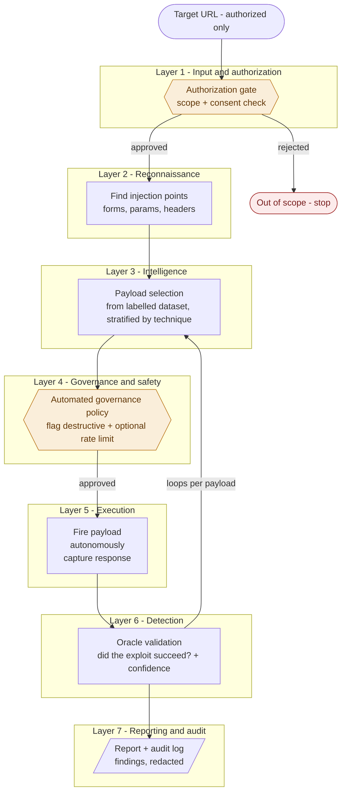

# Offensive IT-Tester

An AI-assisted, **autonomous-but-bounded web-application vulnerability-testing agent** built
for the *Responsible AI & Data Ethics* course. Given an **authorized target URL**, a
**LangGraph**-orchestrated agent walks all seven layers: authorize → live-recon → payload
selection → **governance gate** → **fire the payloads** → **confirm real exploits with
detection oracles** → an open-source-LLM findings report — logging every decision to a
tamper-evident ledger. It confirms genuine SQLi and XSS on the sandbox; an automated
governance policy fires autonomously while flagging destructive payloads.

The offensive capability is the smaller part — the graded emphasis is on making it
**responsible**: authorization at the front, safety limits during, transparency throughout,
and accountability around the whole thing.

> **Scope & safety.** The agent only runs against targets on an explicit allowlist — in
> practice a deliberately vulnerable app we host ourselves (a self-owned Flask sandbox, or
> DVWA in a local Docker container) on a **loopback** address. It *cannot* be pointed at an
> arbitrary third-party site. This keeps the project within German law (§202a/b/c StGB),
> GDPR, and the EU AI Act.

---

## Project status

| Stage | State |
|---|---|
| Data engineering (repair → clean → benign corpus → final dataset) | ✅ **done** |
| Exploratory analysis (`preprocess/analysis.ipynb`) | ✅ **done** |
| Baseline model + fairness + risk (`models/baseline.ipynb`) | ✅ **done** |
| **Agent** — LangGraph orchestration over all 7 layers + audit ledger (`src/agent/`) | ✅ **done** |
| **Layers 1–3: authorization → LIVE recon → payload selection** | ✅ **done** |
| **Layer 4: governance gate** — automated policy (fires autonomously, flags destructive) (`src/governance/`) | ✅ **done** |
| **Layers 5–6: execution → detection** — fire payloads, confirm real exploits (`src/execution`, `src/detection`) | ✅ **done** |
| **Layer 7: report** — open-source LLM (HuggingFace `Qwen2.5-3B`) writes findings | ✅ **done** |
| Live sandbox target (`sandbox/target_app.py`) + live crawler | ✅ **done** |
| Detection oracles: **3 of 6 proven** (`differential`, `browser_execution`, `error_signature`) across Flask + **live DVWA** | ✅ **proven** |
| **Tests** — single weakness-detection notebook (`unit_test.ipynb`), one key question per layer | ✅ **done** |
| **Web UI** — live attack console (`webui.py`): streams each tool call, findings, and a token-by-token report | ✅ **done** |

This README documents both what exists today and the target design it plugs into.

---

## 1. Conceptual architecture (seven layers)

Data flows down; results come back up. The two **safety gates** (authorization and
governance) are the responsible-AI control points.



**In plain language.** You hand the tool an authorized URL. The **authorization gate** asks
"am I allowed to touch this?" — if not, everything stops. **Reconnaissance** finds the doors
(input fields, parameters). The **intelligence layer** picks known payloads for each door
from the dataset (it never invents payloads). Before firing, the **governance gate** asks
"is it safe to send *this* one now?" — an automated rule decides (no human wait); destructive
payloads are flagged for the audit and, in real-engagement mode, held by rule. Approved
payloads are **fired**, the response is read, and the **detection
layer** decides whether a real vulnerability triggered. That select → gate → fire → verify
cycle **loops** across every injection point. Finally the **report** stage collects confirmed
findings, strips real personal data, and writes a report plus a tamper-evident audit log.

---

## 2. How exploitation is verified (the detection oracles)

The dataset is only an *arsenal*; it contains no target responses, so **success cannot be
read from it** — it must be observed on the target. Every fired payload is validated against
a **benign baseline** by one of six **oracle** strategies, keyed on the payload's `type`.
Where possible we **plant a signal we control** (a nonce, a delay, an out-of-band token) so
detection is uniform and near-deterministic.

| Oracle | Proves success by | Used for |
|---|---|---|
| `timing` | response time ≫ baseline (planted delay) | blind-time, stacked-queries SQLi |
| `error_signature` | DB error the baseline didn't show | error-based SQLi |
| `marker_reflection` | a planted nonce is returned by the backend | union SQLi, CMDi echo |
| `differential` | true-vs-false condition responses diverge | tautology, boolean-blind SQLi |
| `browser_execution` | injected JS actually *runs* (headless browser) | reflected/stored XSS |
| `out_of_band` | your collaborator server receives a callback | SSRF, blind CMDi |
| `state_change`\* | forged cross-origin request changes state w/o token | CSRF (semi-manual) |

Each payload already carries its `oracle` label in the dataset. Findings are reported with a
**confidence tier** (high = planted signal returned; medium = timing/differential, confirmed
by repetition; low = unconfirmed → flagged for manual review, never auto-claimed).

> **Honest status.** The table above is the design. Today **3 of the 6 oracles are proven
> end-to-end** across the Flask sandbox *and* live DVWA — `differential` (SQLi), `error_signature`
> (real MySQL error-based SQLi on DVWA), and `browser_execution` (reflected/stored XSS,
> reflection-based). Against DVWA the arsenal's blind/tautology payloads did **not** confirm
> because they target the wrong DBMS/comment style — the tool honestly confirms only what
> actually works.

---

## 3. Project architecture (folders & files)

```
RADE/
├── README.md                      # this file
├── requirements.txt
├── LICENSE
│
├── main.py                        # ✅ AGENT driver: builds the tool registry, runs the decide-act loop
│
├── sandbox/                       # ✅ self-owned LIVE target (loopback-only Flask app)
│   └── target_app.py              #    vulnerable-by-design; the thing recon crawls
│
├── config/                        # ✅ paths + safety rules as DATA
│   ├── paths.py                   #    canonical project paths (ROOT/DATA/RAW_DIR/CLEAN/PROCESSED)
│   ├── target_allowlist.yaml      #    the scope firewall — which hosts may be scanned (sandbox only)
│   ├── targets/dvwa.yaml          #    DVWA crawl config (login, seed paths) + offline profile
│   └── targets/pyapp.yaml         #    self-owned Flask sandbox crawl profile (no auth)
│
├── data/
│   ├── raw/                       # ✅ untouched sources
│   │   ├── WEB_APPLICATION_PAYLOADS.jsonl   # Kaggle attack payloads (needs repair)
│   │   └── csic_2010_benign.csv             # benign extract from HTTP DATASET CSIC 2010 (GPL-3.0)
│   ├── cleaned/                   # ✅ cleaned + execution-ready outputs
│   │   ├── payloads_clean.jsonl / .csv      # 455 repaired, deduped attack payloads
│   │   └── dataset_final.jsonl / .csv       # 2,455-row attack+benign dataset (the deliverable)
│   └── processed/                 # ✅ analysis artifacts
│       ├── payloads_bucketed.jsonl          # attack payloads + context_bucket (from analysis.ipynb)
│       ├── dataset_final.jsonl / .csv       # mirror of the final dataset
│       └── DATA_CARD.md                     # provenance, schema, severity policy, limitations
│
├── preprocess/                    # ✅ the data pipeline
│   ├── preprocess.py              #    STAGE 1-2: raw-text repair + pandas cleaning
│   ├── benign_corpus.py           #    loads/maps/samples benign inputs from CSIC 2010
│   ├── build_dataset.py           #    MASTER: repair → clean → bucket → severity → oracle → merge
│   └── analysis.ipynb             #    EDA: class/severity/context, bucketing, destructive scan
│
├── models/                        # ✅ baseline model
│   ├── baseline.ipynb             #    trains + evaluates + saves; ends with fairness & risk
│   ├── clf_binary.pkl             #    attack-vs-benign detector
│   └── clf_attack_class.pkl       #    5-way attack_class router
│
└── src/                           # the scanner (maps onto layers 1-7)
    ├── agent/                     # ✅ the AGENT — LangGraph orchestrating one tool per layer
    │   ├── tools.py               #    Tool base + ToolRegistry (the agent's capabilities)
    │   ├── layer_tools.py         #    one Tool per layer: authorize/recon/select/govern/execute_detect
    │   ├── graph.py               #    LangGraph state machine: nodes invoke tools; edges branch; LLM triage node
    │   ├── llm.py                 #    open-source LLM client (HuggingFace transformers, local)
    │   └── audit.py               #    hash-chained, tamper-evident run ledger
    ├── authorization/authorize.py # ✅ L1 — allowlist / scope firewall
    ├── recon/recon.py             # ✅ L2 — LIVE injection-point discovery (crawls the target)
    ├── intelligence/select.py     # ✅ L3 — payload selection from the arsenal
    ├── governance/gate.py         # ✅ L4 — hold destructive payloads + per-point rate limit
    ├── execution/execute.py       # ✅ L5 — fire payloads, capture response + timing
    ├── detection/oracles.py       # ✅ L6 — confirm() oracles (error_signature, differential, …)
    └── reporting/report.py        # ✅ L7 — LLM-generated findings report (Art. 50 labelled)
```

**Why an agent, not a pipeline.** Three things make this an agent:

1. **Tools are first-class.** Each layer is a `Tool` (`authorize`, `recon`, `select_payloads`,
   `govern`, `execute_detect`) in a **registry** with a machine-readable spec. The orchestrator
   invokes tools *by name* — it never inlines domain logic.
2. **LangGraph orchestrates, and it branches.** `main.py` builds a **LangGraph** state machine:
   each node invokes one tool; the **edges are the control flow**, and they **branch on observed
   state** — after `authorize` a rejection routes to the end, after `recon` a failure does too,
   so the agent never fires when it shouldn't. Working memory is `RunState`; every node appends
   to a **tamper-evident audit ledger** (`AuditLog.verify()` detects any edit).
3. **The LLM makes a real (bounded) decision.** With `--llm`, a **triage node** hands the
   discovered injection points to a local open-source model (`Qwen2.5-3B-Instruct` via
   HuggingFace) which **re-prioritises them by assessed risk** — genuine model-driven agency.
   It is bounded: the model can reorder but not drop points, and the **automated governance
   policy** (not the model) still decides what fires and flags every destructive payload
   regardless of what it says (a direct answer to OWASP LLM08, excessive agency).

The Layer-7 report is written by the same local LLM from the run's structured facts — it
narrates; it does not decide (findings come from the deterministic oracles).

**Two deliberate choices carried from the design:** `config/` holds safety rules as readable
*data* (allowlist, crawl scope) so an examiner can see the scope firewall at a glance; and
`audit/` is separate from `reporting/` because reports are for the user while audit logs are
the tamper-evident record of what the agent actually did.

---

## 4. The dataset

`data/cleaned/dataset_final.jsonl` — **2,455 rows**, one input string per row.

| Half | Rows | Source |
|---|---|---|
| attack | 455 | Kaggle `WEB_APPLICATION_PAYLOADS` (repaired, deduped from 500) |
| benign | 2,000 | **HTTP DATASET CSIC 2010** normal traffic (sampled, seed 42) |

**15-field schema:**

| field | meaning |
|---|---|
| `id` · `label` · `attack_class` · `type` | identity + the two model targets (attack/benign, 5-way) |
| `payload` | the raw string to send (the **only** model feature) |
| `context` · `context_bucket` | injection point (free-text + normalised to 14 buckets) |
| `severity` · `severity_original` · `severity_reason` | **recomputed** severity + audit trail |
| `is_destructive` · `destructive_flags` | governance-gate hold signals |
| `oracle` | which detection oracle validates this payload |
| `description` · `example` | human context |

### Data quality work (why the pipeline exists)
The raw Kaggle file was **not valid JSON**: 45 non-breaking spaces (some breaking parsing),
a missing comma, a bad escape, 1 empty payload, and 44 duplicate payloads. `preprocess.py`
repairs and de-dupes it. Severity labels were **internally inconsistent** (reflected == stored
XSS, all blind SQLi == medium, CMDi split across three levels), so `build_dataset.py`
**recomputes severity** from a documented `(class, technique)` policy plus payload-content
overrides — **283 / 455 labels changed**, with `severity_original` + `severity_reason` kept
for auditability. Full details in [`data/processed/DATA_CARD.md`](data/processed/DATA_CARD.md).

---

## 5. Baseline model

`models/baseline.ipynb` — **char n-gram TF-IDF + Logistic Regression**, two tasks, with
leakage guards (payload-text-only features, exact-duplicate removal, stratified hold-out,
`class_weight="balanced"`, `DummyClassifier` reference).

| Task | What it does | Macro-F1 | Dummy ref |
|---|---|---|---|
| A — attack vs benign | input-side "is this an attack?" detector | **0.986** | 0.449 |
| B — attack_class (5-way) | router → picks the detection oracle | **0.991** | 0.072 |

**Honest read:** scores are high because the data is easy (clean benign vs syntactically loud
payloads) — treat them as an upper bound. The value is in the **5 false negatives** (SSRF/CMDi
with exotic schemes like `tel:`/`magnet:`, short Windows commands, and encoded payloads) — the
model breaks exactly where an attacker would push. It is kept **advisory, not authoritative**:
the live loop routes by the dataset `type`, so a model error can never silently drop a real
payload. The notebook ends with the model's own **fairness evaluation** and **risk
assessment** (NIST Map → Measure → Manage).

---

## 6. The agent (all 7 layers)

`main.py` builds a **LangGraph** agent and runs it end to end: authorize → recon → select →
**govern** → **execute** → **detect** → **report**. The graph branches on state (a rejection or
a recon failure routes to the end), and every node appends to a tamper-evident ledger
(`audit/audit.jsonl`). See §3 ("Why an agent, not a pipeline") for the architecture.

```bash
# 1. start the self-owned live sandbox (loopback only, no Docker needed)
python sandbox/target_app.py                 # serves http://127.0.0.1:5000

# 2. in another terminal, run the agent against it
python main.py http://127.0.0.1:5000             # full run: fire + confirm exploits
python main.py http://127.0.0.1:5000 --report    # + Layer-7 LLM findings report (reports/)
python main.py http://example.com                # authorization gate REJECTS (out of scope)
python main.py http://127.0.0.1:8080             # DVWA (needs DVWA running in Docker)
```

`--report` uses a local open-source model (`Qwen2.5-3B-Instruct` via HuggingFace
transformers); the weights auto-download on first use (see `config/llm.yaml`).

**What each layer does**
1. **Authorization** — approves the URL only if it's an allowlisted **loopback** host;
   `example.com` and wrong ports are rejected (the scope firewall).
2. **Recon (live)** — connects to the target, crawls its pages, parses every `<form>` field and
   URL parameter with BeautifulSoup to **discover** injection points. DVWA: logs in + sets
   security `low`; Flask sandbox: unauthenticated. **Hard-fails** if the target is unreachable.
3. **Selection** — picks payloads from `dataset_final` per point, **stratified by technique**
   (best `k_per_type`=2 of every `type`), each tagged with the `oracle` that will verify it.
4. **Governance gate (automated policy — no human in the loop)** — the agent fires
   autonomously, so the gate decides **by rule, not by waiting for a person** (human review
   doesn't scale to a large, variable payload count). On the authorized disposable sandbox it
   **approves everything to fire** but **flags destructive payloads** in the audit for
   transparency. Two automated knobs remain for a real engagement: `allow_destructive=False`
   (rule-based hold of destructive payloads) and `max_per_point` (rate limit).
5. **Execution** — fires each approved payload at its injection point and captures the response
   (body, status, timing). The only layer that sends attack input.
6. **Detection** — confirms real exploits with per-technique **oracles**: `error_signature`,
   `differential`, `marker_reflection`, `timing` (+ honest stubs for `browser_execution` /
   `out_of_band`). Each finding carries a confidence tier.
7. **Report** — a local open-source LLM narrates the run's structured facts into a Markdown
   findings report (Art. 50 labelled); the findings come from the oracles, not the model.

**Sample output** (trimmed, Flask sandbox):
```
[LAYER 5-6] EXECUTION → DETECTION
  fired 19 payloads · 7 CONFIRMED exploit(s):
    ✓ sqli/tautology  at sqli    via differential      [medium] — true vs false condition diverged
    ✓ xss/stored      at xss     via browser_execution [medium] — payload reflected unescaped into HTML
========================================================================
CONFIRMED 7 exploits across 6 injection points — by class: {'sqli': 1, 'xss': 6}
[AUDIT] 44 events logged · chain OK — chain intact
```
CMDi / SSRF / CSRF do **not** falsely confirm — their endpoints are simulated / need
infrastructure (a callback server / headless browser) that a local sandbox can't honestly
provide. That boundary is stated, not hidden.

**Responsibility analysis of this pipeline** — selection now **stratifies by technique**, so
SQLi technique coverage rose **3/6 → 5/6** on the offline profile (`union` & `error-based` now
fired). The last gap, `stacked-queries`, needed a `form_field` injection point that the
hand-written profile lacked — a *recon* blind spot, not a selection bias. **Live recon proves
this out:** crawling real DVWA discovers 15 injection points (vs 6 profiled), including
`form_field` endpoints, which lifts coverage to the **full 6/6** — better recon closed the gap
that better selection alone could not. (The baseline *model's* fairness/risk
is separate, inside `models/baseline.ipynb`.)

---

## 7. Reproduce

```bash
# 1. rebuild the final dataset (writes to data/cleaned and data/processed)
python -m preprocess.build_dataset

# 2. train + evaluate + save the baseline models, then read fairness & risk
#    open models/baseline.ipynb and run all cells (use the .venv kernel)

# 3. run the AGENT (all 7 layers) against a live target
python sandbox/target_app.py                # terminal A: start the self-owned sandbox (:5000)
python main.py http://127.0.0.1:5000        # terminal B: crawl → select → gate → fire → confirm
python main.py http://127.0.0.1:5000 --report   # + Layer-7 LLM findings report
python main.py http://example.com           # authorization gate rejects (out of scope)

#    optional DVWA target instead of the Flask sandbox (needs Docker):
#    docker run --rm -it -p 8080:80 vulnerables/web-dvwa
python main.py http://127.0.0.1:8080

# 4. verify the tamper-evident audit ledger
python -c "from src.agent import AuditLog; from config.paths import ROOT; print(AuditLog.verify(ROOT/'audit'/'audit.jsonl'))"
```

The notebook adds the project root to `sys.path` automatically, so it runs whether the kernel
starts in `models/` or the repo root. See [`run.md`](run.md) for full macOS/Windows setup.

**Core dependencies:** `pandas`, `scikit-learn`, `matplotlib`, `joblib`, `jupyter` (data +
model); `requests`, `beautifulsoup4`, `PyYAML`, `flask` (live recon + sandbox + execution);
`langgraph` (orchestration); `transformers` + `torch` (the local Layer-7 LLM, weights
auto-downloaded). See `requirements.txt`.

---

## 8. Regulatory & ethics frameworks

| Framework | Relevance |
|---|---|
| **EU AI Act** (Reg. 2024/1689) | Not a prohibited practice (Art. 5) and not high-risk (Art. 6/Annex III) — a sandboxed academic scanner matches no Annex III category. One live duty: Art. 50 transparency — **✅ implemented**: the Layer-7 LLM report carries an "AI-generated" label. |
| **GDPR** (Reg. 2016/679) | Art. 5(1)(c) data minimisation — training data is payload strings + benign inputs only; **CSIC 2010 is auto-generated, so no real PII**. Purpose (Art. 5(1)(b)) and storage limitation (Art. 5(1)(e)) documented. |
| **StGB** §202a/b/c, §303a/b | Data espionage / interception / hacking-tools / data alteration / sabotage — all neutralised by the **self-owned sandbox + enforced target-scoping + non-destructive default mode + documented authorization** (the central lawfulness argument). |
| **OWASP Top 10** (A03 Injection) + **LLM Top 10** (LLM01/LLM08) | Grounds *what* is tested (injection classes) and the agent-safety concerns (prompt injection, excessive agency → bounded agency, validated inputs). |
| **ISO/IEC 42001** · **NIST AI RMF** | Borrowed structure for the governance layer, risk log, and model card (Govern / Map / Measure / Manage). |

---

## 9. Roadmap
**Done — all seven layers run end to end:**
1. **Fairer selection** — ✅ stratifies by `type` (`k_per_type=2`); SQLi coverage 3/6 → 5/6, and
   live recon closes the last gap (`stacked-queries`) to the **full 6/6** on DVWA.
2. **Live recon** — ✅ `requests` + BeautifulSoup crawler (logs into DVWA / crawls the Flask
   sandbox); **hard-fails** if the target is down.
3. **The agent** — ✅ **LangGraph** state machine orchestrating all 7 layers, with a
   tamper-evident audit ledger.
4. **Governance gate (Layer 4)** — ✅ automated policy: fires autonomously, flags destructive; per-point
   rate limit, before anything is fired.
5. **Execution + detection (Layers 5–6)** — ✅ fires approved payloads and confirms real exploits
   with per-technique oracles (`error_signature`, `differential`, `marker_reflection`, `timing`).
6. **Reporting (Layer 7)** — ✅ local open-source LLM (HuggingFace `Qwen2.5-3B`) writes the
   findings report; Art. 50 label + deterministic facts block.

**Next (designed, not built):**
- `browser_execution` oracle (headless browser) and `out_of_band` oracle (callback server) — the
  two confirmations a self-owned local sandbox can't honestly provide.
- An adversarial eval set (URL-encode / case-swap) to measure the baseline model's evasion.
